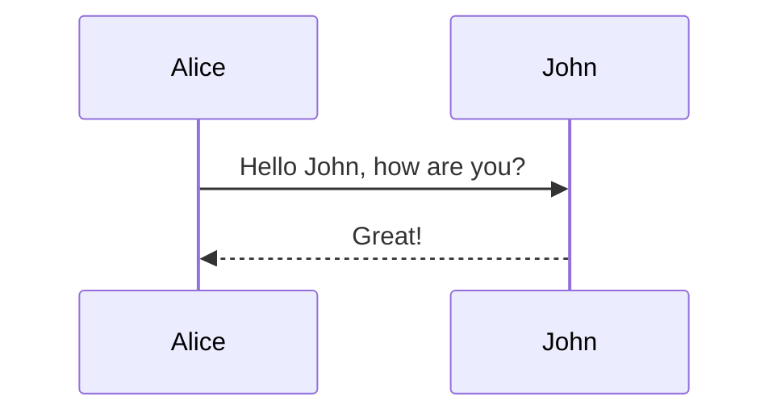

## 前言

很难免俗的，不理解货币的实质，很难去理解数字加密货币，以及国家为什么想要控制数字货币的发行。不再赘述，货币的实质是一种市场交易的解决方案，这种工具属性本身是货币的**价值**，而让货币具有这种工具属性的前提条件，是维持货币价格的稳定，至于货币的背后是金本位，还是国家信用，抑或是房产资产，目的都是维持货币**价格**的稳定。

而提到数字货币，又很难绕开比特币，简单介绍下比特币，比特币的实质是一个去中心化的转账系统，它的底层基于区块链，所谓区块，实际上是一页账本，交易越多，区块就会累积，形成一个链，称为区块链，中本聪设计了一种工作量证明的共识机制来发行比特币，每个区块出一道数学题，谁最快解出来，谁就拥有这次的记账权，每个区块会产生一些比特币，用来奖励记账的人，而“挖矿”就是指获取记账权以得到比特币作为奖励。**比特币的问题出在货币发行机制上**，挖矿者都在解一道无用的题目，表面上付出了劳动，消耗了电，但是没有产生价值，发行方没有获得任何资产以在比特币价格发生波动时来维护比特币价格的稳定。所以比特币没有办法成为一种世界范围内的货币，最终沦为了一种数字投机产品。

那么Libra的出现可以给我们带来一些什么启示，Libra是如何做的以试图成为一种无国界货币，Libra可以有效的避免及解决比特币存在的问题吗？

## 读《Libra白皮书》

主要介绍了Libra的愿景，是可以在全世界有网络连接的地方，有一种世界性的数字加密货币可以让交易高效安全的进行，期望打造一个更加完备的金融系统，这个金融系统有以下特征：

1. 建立在安全，可扩展，可信赖的区块链之上
2. Libra货币的发行是依托于现实中的一篮子银行资产和短期政府债券
3. 独立的机构**Libra Association**进行管理

那我们需要从中读到的应该是有两点，一是Libra的底层技术核心是区块链，并且是有自己的想法在的，比如使用的不再是工作量证明机制了，而是一种新的共识协议，这个我们在下一部分详细说明，二是Libra维持货币的稳定的核心还是以当前货币为基准，其实我在前言里也说过，不管什么方式，目的都是维护货币的价格稳定，使其行使自己的货币职能——即作为市场交易的媒介。

## 读《The Libra Blockchain》

本小节大体是要披着探讨经济的外壳来聊技术了，如果你对此不感兴趣，那就快速的浏览下并直接奔向总结部分吧。

在这一小节我们将对Libra区块链有基本理解，重点关注两个问题：

1. 如何达成共识，如何在区块链中记账
2. 如何借助区块链达成一笔交易

### 共识协议

Libra区块链的两个核心概念是状态(State)和交易(Transaction)，且状态由交易驱动：
$$
S_N=F(S_{N-1},T_N) \tag{1}
$$
式（1）中$F$是一个确定性函数，即每次输入相同的$S_{N-1}$和$T_N$,$F$都会返回同一个状态$S_N$，驱动示意如下图所示：

首先我们先对区块链网络有个基本认知，整个区块链网络由多个被授权的validator节点组成，底层基于一个单版本分布式数据库（single-versioned distributed database），某一个状态Sn包含了区块链中所有账号的信息，那么每一个validator节点在执行交易的时候，就需要同步到状态的最后一个版本;具体而言，一个验证节点如下图所示：

BTW，Libra的协议是用Move语言实现的，可能你并不关心，但是我倒是挺感兴趣的，Move到底是一个怎样的语言呢，这个我会单独再写篇文章探讨下。

## 总结及展望

- 无国界货币

- 无国界的支付网络及区块链网络

货币可以在全球自由流通，可以大大降低金融成本，但另一方面，对这个网络的监管是个挑战

- 对央行数字货币的启发

### 后续有新的理解会更深入的分析下面的问题

- 数字货币目前的瓶颈是什么

  发行机制，无法维持价格稳定

- 央行发行的数字货币与现有货币体系应具有什么关系

- 央行如何维护数字货币价格的稳定（资产背书是一种方式，是否存在别的方式呢）

- 数字货币一旦设备丢失如何找回，安全性如何保证

- 发行机制（共识本位？）

- 非政府背景的非官方货币如何与法币进行竞争

- 另外表达一下自己最近比较深刻的一点感受

  发现对于同一件事，讲述的原理是一样的，站在全局的角度看问题和站在个人的角度表述观点完全不同，有的人自以为看懂经济发展规律，发现了经济中的一些问题，便延展到危机爆发后会是怎样惨烈的局面，社会的不公平是怎样，普通人的财富是如何被少数人收割；而从全局的角度，我们可以看到的表述是这样，社会的现状是怎样，这样的现状好不好，不好是哪些问题导致的，目前上层建筑对这些问题的认知是怎样的，采取了哪些政策，这些政策的有效性如何，政策的长期方向是怎样，未来的理想状态是怎样；不好的地方，想去了解的人自然可以知道，我们的国家需要发现问题的人，但是不需要发现问题就自以为是去传播悲观情绪的人，我们的国家及民族更需要的是英雄，是那些处变不惊，挽大厦于将倾，勇于担当尝试的人，以合理的方式去解决问题才是正道。

## reference

- libra官网 [文档](https://developers.libra.org/docs/welcome-to-libra)
- Libra白皮书 [Libra white paper](https://libra.org/en-US/white-paper/#introduction)
- Libra技术论文 [The Libra Blockchain](https://developers.libra.org/docs/the-libra-blockchain-paper)