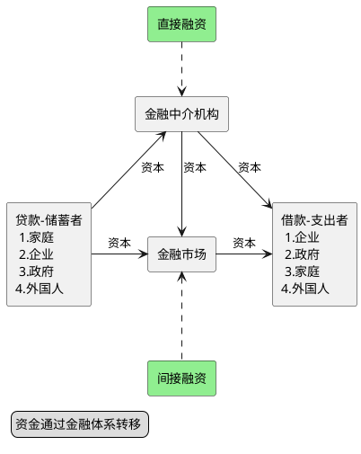

## 前言
随着新冠疫情全球蔓延，油价、股市，全线暴跌，会不会触发经济危机呢，股票市场何去何从，想要做出判断，我们先回到问题本身，今天带来《货币金融学》剩下的两部分内容：
- 08金融危机起因，美国政府的救市措施
- 股票价格决定机制

## 由08金融危机谈金融体系及货币政策

金融危机是以资产价格急剧下跌和企业破产为特征的金融市场的大动荡。08年的全球金融危机源于2007年8月开始**次级抵押贷款**市场上的违约事件造成了金融市场的剧烈震荡。从2007年12月开始出现经济大衰退，到2008年秋天经济已然失控，结束于2009年6月。华尔街的公司和商业银行遭受了数千亿美元的损失。居民和企业发现发现借款利率迅速提高，并且很难申请到贷款。世界各地的股票市场都出现剧烈震荡，美国股票市场自峰值下跌了50%以上。包括商业银行、投资银行和保险公司在内的许多金融企业陷入破产泥潭。

在深入分析金融危机的起因经过结果反思之前，有一些铺垫我们必须要做，为什么我们的经济运行会如此依赖银行，为什么次级抵押贷款会造成如此之大的影响，这些问题涉及到金融机构诞生的目的，当前金融体系的结构，之后会介绍如何构建一个理解**金融危机发展过程的理论框架**并以此来回顾08金融危机的发展历程，最后讨论政府的救市行为及美国事后对危机的反思，如何**加强对金融机构的监管**。

### 金融体系的结构

金融体系是由银行、保险公司、共同基金、财务公司、投资银行等不同类型的金融机构构成的复杂系统。运转良好的金融市场和金融中介是经济社会健康运行的关键要素。金融市场（股票和债券市场）和金融中介机构（银行 、保险公司和养老基金）**最基本的功能**就是融通资本和生产间的相互需求，从那些由于支出少于收入而积蓄了盈余资金的家庭、公司和政府那里，将资金引导到那些由于支出超过收入而资金短缺的的经济主体那里，下图可以描述这个流程：

从图中可以看出，金融体系中的两个核心就是金融市场和金融中介结构。

#### 金融市场及作用

金融市场有助于资本的合理配置，从而对增加生产和提高效率做出贡献，对提高经济社会的效率有着无可替代的作用。

金融市场可以被分为：

- 债权市场和股权市场
- 一级市场和二级市场
- 交易所和场外市场
- 货币市场和资本市场

#### 金融中介机构及作用

主要的金融中介结构可以分为三类：

1. 银行，包括商业银行、储蓄与贷款协会、互助储蓄银行、信用社
2. 契约性储蓄结构，包括人寿保险公司、火灾和意外伤害保险公司、养老基金
3. 投资中介结构，包括财务公司、共同基金、货币市场共同基金、对冲基金

金融中介结构通过发行负债筹集资金，并通过购买证券或发放贷款获得资产的金融机构。金融中介机构可以降低交易成本，分担金融风险，解决**逆向选择**和**道德风险**问题，从而允许小额储蓄者和借款人参与金融市场，进而提高了经济的效率。不过范围经济虽然有利于金融中介机构，但会诱发利益冲突问题，从而降低金融体系效率。

> **逆向选择**：在交易**之前**，信息不对称导致的问题是逆向选择，潜在不良贷款，风险来自那些积极寻求贷款的人
>
> **道德风险**：在交易**之后**，信息不对称导致的问题是道德风险，借款人可能从事不利于贷款人的活动

### 金融危机

运转良好的金融体系可以解决信息不对称的问题，这些信息不对称问题阻碍了资本的有效分配，这常常被经济学家称为**金融脆弱性**，当金融脆弱性加剧时，金融市场就无法有效地将资金从储蓄者融通给具有生产性投资机会的居民和企业，进而导致经济活动的收缩。当金融市场的信息流动出现极为严重的震荡时，金融脆弱性机会显著加剧，金融市场停止运转，**金融危机**爆发，经济活动崩塌。

#### 金融危机发展过程理论框架

发达经济体的金融危机一般经过两个阶段，有时是三个阶段。

##### 阶段一：金融危机的导火索

金融危机的源头可能可能有两种：一是信贷繁荣和破灭，二是金融机构破产带来的不确定性增加

##### 阶段二：银行业危机

资产负债表和企业状况的恶化导致一些金融机构破产。逆向选择和道德风险加剧，贷款萎缩，经济活动收缩

##### 阶段三：债务萎缩

价格水平意料之外大幅下跌加重企业债务负担，引起净值进一步恶化。

### 政府救市所采取的货币政策

## 股票的价格决定机制

> 未完待续

## reference

弗雷德里克·S·米什金[《货币金融学》](https://book.douban.com/subject/26950185/)
